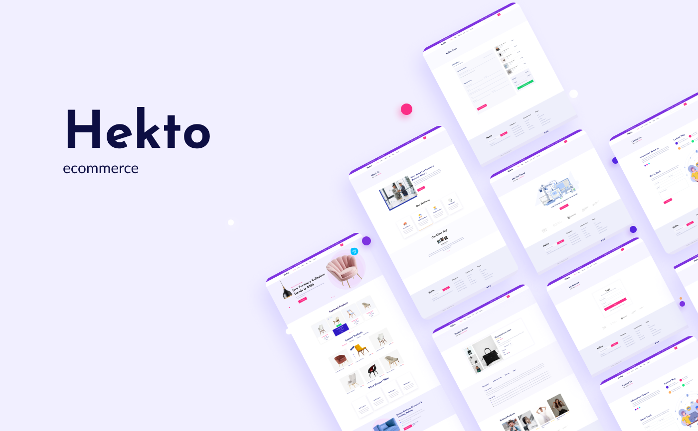

<br>

# **Hekto Ecommerce 🛍️**

[🇺🇸 Read this page in English]('./README.md)

<br>

<h4 align="center"> 
	🚧  Hekto Ecommerce 🛒 Em construção...  🚧
</h4>

<br>

## **Descrição do Projeto**

<br>

<p align="center">Esse projeto tem por objetivo o desenvolvimento de um ecommerce com integração de um blog para fins de estudo. Somos uma equipe formada por 5 pessoas, divididas entre front end e back end. <br> Este repositório contém o código relacionado ao Front End.</p>

<br>

## **Requerimentos**

- NodeJS 16+
- Yarn 1+

<br>

## **Rodando localmente**

<br>

Clone o repositório

```bash
  git clone https://github.com/anacornachi/hekto-ecommerce.git
```

Instale as dependências do projeto

```bash
  yarn
```

Após a instalação, rode o comando abaixo e o projeto estará acessível na porta 3000 em modo desenvolvimento

```bash
  yarn dev
```

Caso queira gerar uma versão para produção, basta usar

```bash
  yarn build
```

Para rodar testes, execute o comando

```bash
  yarn test
```

<br>

## **🛠 Tecnologias**

As seguintes ferramentas foram usadas na construção do projeto:

- [Next.JS](https://nextjs.org)
- [TypeScript](https://www.typescriptlang.org/)
- [Jest](https://jestjs.io/pt-BR/)
- [Testing Library](https://testing-library.com/)
- [Chakra UI](https://chakra-ui.com/)
