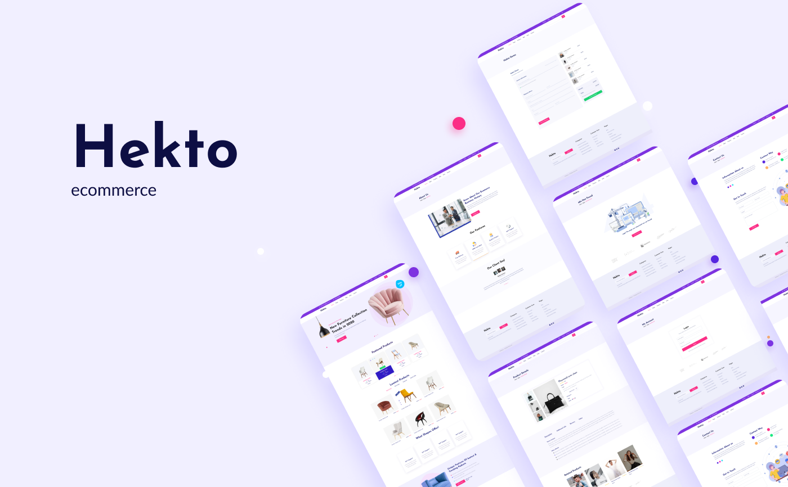

<br>

# **Hekto Ecommerce 🛍️**

[🇧🇷 Leia esta página em português](./README-pt.md)

<br>

<h4 align="center"> 
	🚧  Hekto Ecommerce 🛒 Under development...  🚧
</h4>

<br>

## **Project Description**

<br>

<p align="center">This project aims to develop an ecommerce and an integrated blog for studies purposes. We are a team composed of 5 members, divided between front-end and back-end developers.<br> This repository contains frontend related code.<p>

<br>

## **Requirements**

- NodeJS 16+
- Yarn 1+

<br>

## **Running locally**

<br>

Clone repository

```bash
  git clone https://github.com/anacornachi/hekto-ecommerce.git
```

Install project dependencies

```bash
  yarn
```

After installation, run the command bellow and the project will be available on port 3000 in development mode

```bash
  yarn dev
```

If you want to generate a version for production, just use

```bash
  yarn build
```

To run tests, execute this command

```bash
  yarn test
```

<br>

## **🛠 Technologies**

The following tools were used to develop this project:

- [Next.JS](https://nextjs.org)
- [TypeScript](https://www.typescriptlang.org/)
- [Jest](https://jestjs.io/pt-BR/)
- [Testing Library](https://testing-library.com/)
- [Chakra UI](https://chakra-ui.com/)
